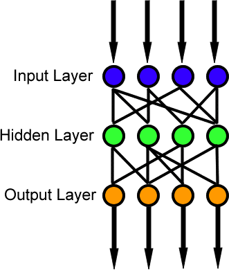
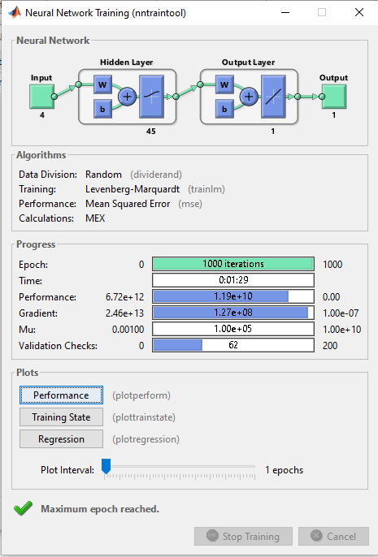
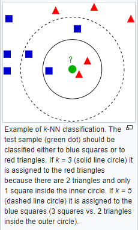

# Electric-Load-Forecasting-using-different-techniques
Electric Load forecasting for a year on hourly basis using 3 different techniques. - linear Regression, - ANN (Using Matlab nntool), -K-Nearest Neighbor. All 3 codes are present with an detailed report on each technique.

# Results:
- Linear Regression, MAPE - 17.98 %
- Artificial Neural Networks (ANN) (Using MATLAB's 'nntool'), MAPE - 10.62 %
- K-Nearest Neighbor, MAPE - 10.56 %
• These forecasting techniques work effectively and can be applied for other forms of forecasting.

# Applications: 
Order Quantity/Demand/Supply/Sales Forecasting, Power/Electric Forecasting, Statistical Quantitative Forecasting.

#

# Artificial Neural Network Model Used

# ANN Matlab Model with final output results

# K-Nearest Neighbor Technique

